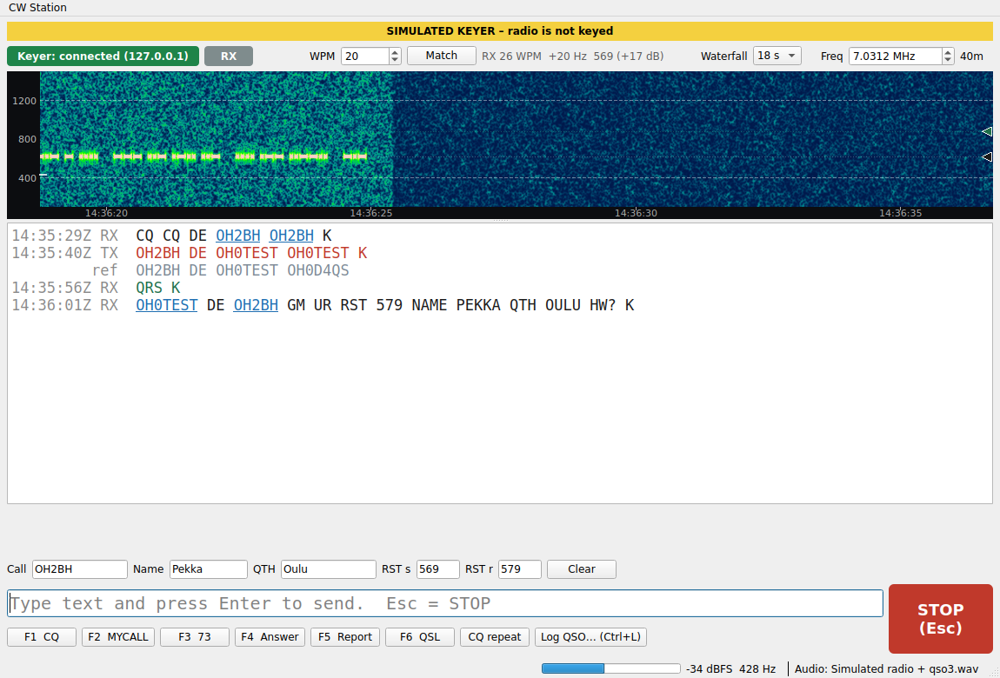
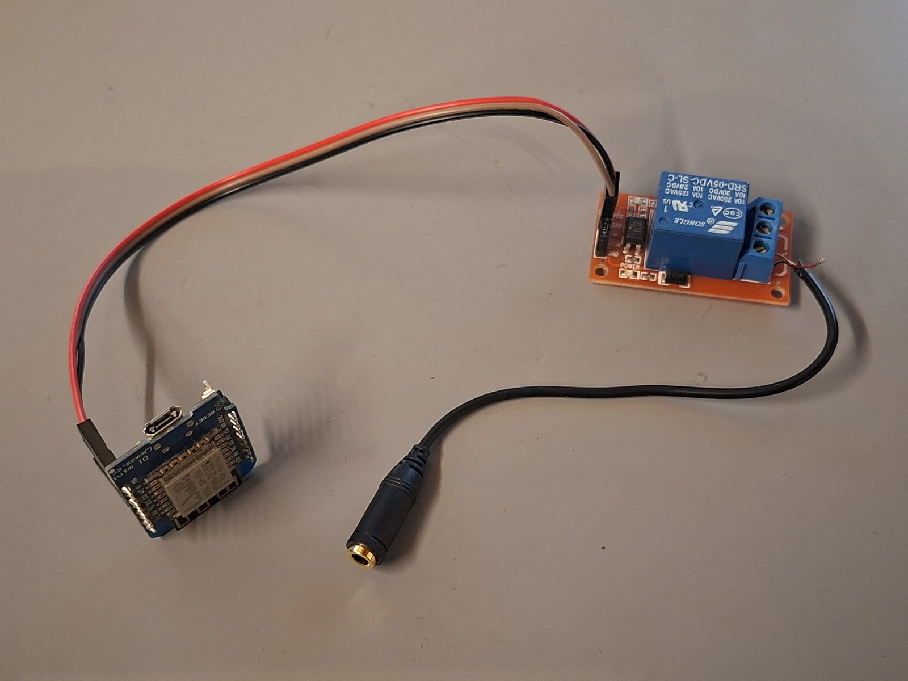

# CW Keyer

Tietokoneohjelma, joka tulkitsee radiosta kuuluvan sähkötyksen tekstiksi ja lähettää kirjoittamasi tekstin takaisin CW:nä, eli CW-yhteydet onnistuvat ilman omaa sähkötystaitoa.



Radion avainnuksen voi hoitaa mikrokontrollerilla (ensimmäinen demoversio Wemos D1 mini, ESP8266), joka sulkee WiFi-käskystä radion avainlinjan kytkimellä: kokeiluun riittää tavallinen mekaaninen relekortti, mutta pysyvään asennukseen kannattaa vaihtaa reed-rele tai PhotoMOS-rele, esim. PVT412 (400 V, napaisuudeton, ei kulu – kestää myös putkiradion negatiivisen hilajännitteen).

```
radio --ääni--> PC (CW Station) --WiFi--> Wemos D1 mini --D1--> rele --> radion KEY-jakki
                                                                          tip = avain
                                                                          sleeve = maa
```



Koko rautaosa on tässä: mikrokontrolleri, relemoduuli ja jakkijohto, osia kymmenisellä eurolla, ei piirilevyä eikä koteloa. Se riittää, koska äly asuu ohjelmassa — ajoitus, tulkinta, makrot ja loki hoidetaan PC:llä, ja raudan ainoa tehtävä on sulkea avainlinja käskystä ja päästää irti heti, jos ohjaus katkeaa. Kytkentä ja testit: [`hardware/`](hardware/).

| Kansio | Sisältö |
| --- | --- |
| [`hardware/`](hardware/) | Kytkentä, osaluettelo ja laitteistotestit |
| [`firmware/cwkeyer-esp8266/`](firmware/cwkeyer-esp8266/) | Keyerin firmware, kytkentäohje ja WebSocket-protokolla |
| [`cwstation/`](cwstation/) | Ohjelma (Python + PySide6) – käyttöohje ja asennus: [`docs/cwstation.md`](docs/cwstation.md) |

**Release 0.5.0 on karkea demo**, mutta jo täysin kokeilukelpoinen: sillä on tehty oikeita QSO:ita, ja mukana ovat vesiputousnäyttö, makrot, ADIF-loki, Wavelog-lähetys sekä vastaaseman nopeuden, sävelkorkeuden ja signaalin voimakkuuden mittaus (RST-ehdotus).

AGPL-3.0-or-later. Sähkötyksen tulkinta perustuu [DeepCW](https://github.com/e04/deepcw-engine)-malliin. Great many thanks to [e04](https://github.com/e04) for your wonderful work! 73s!
