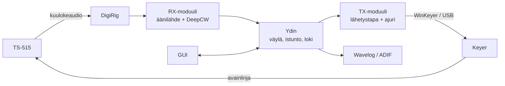

# CW-asema – vaatimusmäärittely

2026-09-16 · @Someone

## 1. Tausta ja visio

Järjestelmä on tietokoneohjelmisto, jolla CW-yhteydet TS-515:llä onnistuvat ilman omaa sähkötystaitoa: DeepCW tulkitsee vastaanoton ja sama näkymä ohjaa fyysistä avainta.

**Tausta.** Kenwood TS-515:ssä on huomattavasti enemmän tehoa kuin Xiegu G90:ssä. Operaattori ei vielä sähkötä itse. Morse Expert (Android) on toiminut tulkkina hyvin, mutta se ei lähetä eikä kirjaa mitään, ja tulkki ja lähetys ovat eri laitteissa.

**Visio.** Modulaarinen rajapinta ihmisen ja radion välillä: äänilähde, tulkki, lähetystapa, avainlaite ja radio ovat vaihdettavia osia saman käyttöliittymän alla. CW on ensimmäinen lähetystapa, muita modeja katsotaan myöhemmin.

**Tavoitteet**

1. Vastaanotettu CW näkyy luettavana tekstinä reaaliajassa, vähintään Morse Expertin tasoisesti.
2. Kirjoitettu teksti lähtee radiosta CW:nä samasta näkymästä, ja lähetetty ja vastaanotettu teksti näkyvät yhdessä virrassa.
3. Lähetys pysähtyy aina hallitusti: STOP ja aikarajat toimivat myös vikatilanteessa.
4. Arkkitehtuuri sallii myöhemmin makrot, lokituksen, Hellin, muut radiot ja oman keyer-laitteen ilman uudelleenkirjoitusta.

## 2. Laajuus ja prioriteetit

Ensimmäinen versio (MVP) ratkaisee ydinongelman: DeepCW-tulkinta ja avaimen ohjaus yhdestä GUI:sta turvarajoineen.

| Taso | Sisältö |
| --- | --- |
| P1 – MVP | Äänilähde → DeepCW → aikaleimattu tekstivirta; tekstikenttä → keyer; merkkikohtainen kaiku; nopeussäätö; STOP ja aikarajat; muutama kiinteä makro (CQ, oma tunnus, 73) |
| P2 – lisämausteet | Muokattavat makrot muuttujineen, tekstiloki tiedostoon, QSO-lomake ja hyväksyntä, ADIF-tiedosto, Wavelog-lähetys, tunnusten tunnistus tekstistä, CQ-toisto, oman lähetyksen tarkistus, TUNE, testitila |
| P3 – myöhemmin | Hellschreiber (audio ja avainlinja), radioprofiilit (TS-515, G90 CATilla), oma ESP32-keyer, paddle-tulo, kilpailupohjat (OH-kilpailut), etäkäyttö |
| Rajattu pois | POTA/SOTA-erityistoiminnot, oma äänikorttilevy (audio hoidetaan DigiRigillä tai tietokoneen äänikortilla), Morse Expert -integraatio, sähkötyksen opetustoiminnot |

## 3. Laitteisto ja ympäristö

Asema koostuu TS-515:stä, WinKeyer-yhteensopivasta keyeristä, Xiegu DE-19:sta ja Windows-tietokoneesta; kaikki paitsi keyer ovat jo olemassa.

| Osa | Valinta | Huomiot |
| --- | --- | --- |
| Radio | Kenwood TS-515 | Grid-block-avainnus, negatiivinen avainjännite (mitattava). Ei CATia eikä AUX-tuloa. CW-tilassa T/R VOXilla. |
| Keyer | Open CW Keyer MK2 tai DIY Arduino Nano + H11D1 (K3NG-firmware) | WinKeyer-emulointi. MK2:n optoerottimen jännitekesto tarkistettava TS-515:n jännitettä vasten. Myöhemmin oma ESP32-S3-levy. |
| Audio | Äänikortti tai DigiRig | TS-515:n kuulokelähtö → DigiRig. TX-audio (Hell) mikrofoniliittimen kautta myöhemmin. Tarvittaessa erotusmuuntaja. |
| Varalaite | Xiegu DE-19 | Pysyy G90:n käytössä. |
| Tietokone | Windows ensisijainen, Linux toissijainen | Kellon NTP-synkronointi (UTC-aikaleimat). |
| Loki | Wavelog + WaveLogGate | QSO:t Gaten UDP-porttiin tai suoraan Wavelogin API:in; aina myös paikallinen .adi. |
| Tulkki | DeepCW (e04) | ONNX-malli, AGPL-3.0. |

## 4. Arkkitehtuuri ja moduulit

Ohjelmisto jaetaan neljään moduuliin, jotka keskustelevat JSON-viesteillä yhteisen tapahtumaväylän kautta, jotta ne voivat myöhemmin toimia eri koneilla.



Kuvassa radion audio kulkee DigiRigin kautta tulkille, ja kirjoitettu teksti kulkee ytimen ja keyerin kautta takaisin radioon.

| Moduuli | Vastuu | Vaihdettavat osat |
| --- | --- | --- |
| RX | Äänen luku, tasojen hallinta, tulkinta, tulkitun tekstin tapahtumat (aika, taajuus/kanava, teksti) | Äänilähde (äänikortti, WAV), tulkki (DeepCW, myöhemmin muut) |
| TX | Tekstin muunto lähetettäväksi, lähetysjono, kaiku, STOP | Lähetystapa (CW, myöhemmin Hell), ajuri (WinKeyer, oma ESP32, audio) |
| Ydin | Tapahtumaväylä, asetukset, tekstiloki, QSO-tila, ADIF ja Wavelog, turvalogiikka | Lokikohteet |
| GUI | Tekstivirta, syöttö, makrot, asetukset, tilanäytöt | – |

**Periaatteet**

- CW-ajoitus tehdään keyerissä, ei tietokoneella.
- Loki ja turvalogiikka ovat ytimessä, eivät GUI:ssa: selaimen tai ikkunan sulkeminen ei hukkaa dataa eikä jätä avainta alas.
- Lähetystapa ilmoittaa, mitä lähtötyyppejä (avainlinja, audio) se tukee.

## 5. Käyttötapaukset

MVP kattaa käyttötapaukset UC1, UC8 ja UC12; muut toteutetaan niiden päälle.

| ID | Käyttötapaus | Kuvaus | Prioriteetti |
| --- | --- | --- | --- |
| UC1 | Tavallinen QSO | Operaattori lukee tulkin tekstiä, kirjoittaa vastauksen tai käyttää makroa; lähetetty teksti näkyy samassa virrassa eri värillä. | P1 |
| UC8 | Turvallisuus | STOP GUI:sta, Esc-näppäimellä ja keyeristä; kantoaallon ja lähetyksen aikarajat; yhteyskatkos vapauttaa avaimen. | P1 |
| UC12 | Pelkkä kuuntelu | Tulkki pyörii ja kirjoittaa aikaleimattua tekstiä ilman lähetystä. | P1 |
| UC4 | CQ ja vastaaminen | CQ-makro toistuu väliajoin ja keskeytyy, kun omalta taajuudelta tulkkautuu tekstiä. Tunnukset korostetaan, klikkaus vie ne muuttujaan `{CALL}`. | P2 |
| UC5b | Aikaleimattu tekstiloki | RX- ja TX-rivit UTC-aikaleimoin tiedostoon; rivi vaihtuu tauon (esim. yli 10 s) tai suunnan vaihdon kohdalla. | P2 |
| UC6 | QSO-kirjaus | Yhteenvetoikkuna, jonka kentät tulkki ehdottaa (CALL, RST, NAME, QTH); operaattori hyväksyy → .adi-tiedosto ja Wavelog. Taajuus ja bandi syötetään käsin, ellei saada myöhemmin tehtävältä CAT-yhteydeltä. | P2 |
| UC10 | Asetukset ja profiili | Oma tunnus, nimi, QTH, lokaattori, äänenvoimakkuudet, makrot, keyer-, ääni- ja Wavelog-asetukset kahdessa paikassa.&#32; | P2 |
| UC11 | TUNE | Kantoaalto aikarajalla viritykseen (PLATE/LOAD). | P2 |
| UC13 | Oman lähetyksen tarkistus | Tulkki kuulee sivuäänen; ohjelma vertaa sitä lähetettyyn tekstiin ja varoittaa eroista. | P2 |
| UC14 | Testitila | TX ei avainnuta radiota (sivuääni tietokoneesta); RX lukee WAV-tiedostoa. | P3 |
| UC15 | Hell-lähetys | Teksti lähtee Feld Hellinä audiona (SSB) tai avainlinjalla. | P4 |
| UC16 | Hell-vastaanotto | Vierivä kuvanauha; kuvapalat aikaleimoin lokiin. | P4 |
| UC17 | Radioprofiilit | TS-515 ja G90 (CAT Hamlibin kautta, taajuus automaattisesti lokiin). | P3 |
| UC5 | Kilpailut | Kilpailupohjat: vaihto, sarjanumerot, dupe-tarkistus, F-näppäinmakrot. OH-kilpailut. | P3 |
| UC9 | Etäkäyttö | Moduulit eri koneilla verkon yli. Arkkitehtuuri huomioi, ei toteuteta vielä. | P2 |

## 6. Toiminnalliset vaatimukset

Vaatimukset on numeroitu moduuleittain, jotta testit ja tehtävät voivat viitata niihin suoraan.

### RX – vastaanotto ja tulkinta

| ID | Vaatimus | Prio | UC |
| --- | --- | --- | --- |
| FR-RX-01 | Käyttäjä valitsee äänilähteen järjestelmän äänilaitteista; valinta säilyy. | P1 | UC1, UC12 |
| FR-RX-02 | Tulkki (DeepCW) tulkitsee äänen reaaliajassa, viive merkin kuulumisesta näkymiseen alle 2 s. | P1 | UC1 |
| FR-RX-03 | Tulkittu teksti julkaistaan tapahtumina: UTC-aika, kanava/äänitaajuus, teksti. | P1 | UC1, UC12 |
| FR-RX-04 | GUI näyttää tulotason mittarin ja varoittaa ylityksestä tai liian heikosta tasosta. | P1 | UC1 |
| FR-RX-05 | Automaattinen tason normalisointi, jotta AF GAIN -säädön muutos ei riko tulkintaa. | P2 | UC1 |
| FR-RX-06 | Äänilähteeksi voi valita WAV-tiedoston. | P3 | UC14 |
| FR-RX-07 | Tulkittavan signaalin valinta, jos päästökaistalla on useita signaaleja. | P2 | UC1 |

### TX – lähetys

| ID | Vaatimus | Prio | UC |
| --- | --- | --- | --- |
| FR-TX-01 | Käyttäjä kirjoittaa tekstiä, joka lisätään lähetysjonoon; jonoa voi muokata ennen lähetystä. | P1 | UC1 |
| FR-TX-02 | Keyeriä ohjataan WinKeyer-protokollalla sarjaportin kautta. | P1 | UC1 |
| FR-TX-03 | Lähetetyt merkit kaiutetaan merkki kerrallaan tekstivirtaan eri värillä. | P1 | UC1 |
| FR-TX-04 | Nopeutta (WPM) voi säätää lennossa; painotus säädettävissä. | P1 | UC1 |
| FR-TX-05 | Vähintään kolme kiinteää makroa: CQ, oma tunnus, 73. | P1 | UC1 |
| FR-TX-06 | Muokattavat makrot muuttujilla `{MYCALL}`, `{CALL}`, `{NAME}`, `{RST}`; pikanäppäimet. | P2 | UC4 |
| FR-TX-07 | CQ-toisto säädettävällä välillä, keskeytyy tulkitusta tekstistä omalla taajuudella. | P2 | UC4 |
| FR-TX-08 | TUNE: jatkuva kantoaalto, oletus 10 s, enimmäisaika asetuksissa. | P2 | UC11 |
| FR-TX-09 | Testitila: ei avainnusta, sivuääni tietokoneen kaiuttimesta. | P2 | UC14 |
| FR-TX-10 | Oman lähetyksen tulkinnan vertailu lähetettyyn tekstiin ja varoitus poikkeamasta. | P2 | UC13 |

### Ydin, loki ja asetukset

| ID | Vaatimus | Prio | UC |
| --- | --- | --- | --- |
| FR-CORE-01 | Asetukset tallennetaan tiedostoon ja ladataan käynnistyksessä. | P1 | UC10 |
| FR-CORE-02 | Tekstiloki: RX- ja TX-rivit UTC-aikaleimoin, rivinvaihto tauon (säädettävä, oletus 3 s) tai suunnan vaihdon kohdalla. | P2 | UC5b, UC12 |
| FR-CORE-03 | Tunnusten tunnistus tulkitusta tekstistä ja korostus; klikkaus asettaa `{CALL}`. | P2 | UC4 |
| FR-CORE-04 | QSO-yhteenvetoikkuna, jonka kentät esitäytetään tulkitusta tekstistä; käyttäjä hyväksyy. | P2 | UC6 |
| FR-CORE-05 | Hyväksytty QSO lisätään heti paikalliseen .adi-tiedostoon. | P2 | UC6 |
| FR-CORE-06 | Hyväksytty QSO lähetetään Wavelogiin (WaveLogGate UDP tai Wavelog API, valittavissa). | P2 | UC6 |
| FR-CORE-07 | Taajuus ja bandi syötetään käsin ja pysyvät voimassa, kunnes niitä muutetaan. | P2 | UC6 |

## 7. Turvallisuusvaatimukset

Kaikki turvavaatimukset ovat P1: avain ei saa jäädä alas missään vikatilanteessa, koska TS-515:n pääteputket ovat vanhoja ja vaikeasti korvattavia.

| ID | Vaatimus |
| --- | --- |
| SR-01 | STOP-painike on aina näkyvissä GUI:ssa; Esc toimii mistä tahansa kentästä. STOP tyhjentää jonon ja nostaa avaimen alle 50 ms:ssa. |
| SR-02 | Jatkuvan kantoaallon enimmäiskesto (oletus 10 s, myös TUNE); ylitys nostaa avaimen ja näyttää virheen. |
| SR-03 | Yhtenäisen lähetyksen enimmäiskesto (oletus 120 s) ilman käyttäjän toimenpidettä. |
| SR-04 | Jos yhteys keyeriin katkeaa tai ohjelma kaatuu, avain nousee. Keyerin oma STOP (paddle/painike) toimii tietokoneesta riippumatta. |
| SR-05 | Ohjelman käynnistyessä ja sulkeutuessa avain on yläasennossa; sulkeminen lähetyksen aikana lähettää ensin STOPin. |
| SR-06 | Avainlinjan kytkin kestää TS-515:n mitatun avainjännitteen vähintään kaksinkertaisella marginaalilla ja on galvaanisesti erotettu. |
| SR-07 | Testitilan ja lähetystilan ero näkyy GUI:ssa selvästi; TX-tila osoitetaan myös tilailmaisimella. |

## 8. Ei-toiminnalliset vaatimukset

Ohjelmiston pitää toimia Windowsilla sujuvasti tavallisella kotikoneella ilman internet-yhteyttä.

| ID | Vaatimus |
| --- | --- |
| NFR-01 | Alusta: Windows 11 ensisijainen, Linux toissijainen. Sama koodipohja molemmille. |
| NFR-02 | Toimii ilman internet-yhteyttä; tulkinta tehdään paikallisesti (ei pilvipalvelua). Wavelog-lähetys jonoutuu, jos yhteys puuttuu. |
| NFR-03 | Tulkinta pyörii reaaliajassa tavallisella kannettavalla ilman erillistä näytönohjainta. |
| NFR-04 | Moduulien välinen viestintä dokumentoidaan (JSON-skeemat), jotta moduuleja voi vaihtaa ja ajaa eri prosesseissa. |
| NFR-05 | Aikaleimat UTC:ssä; kellon epäsynkronista varoitetaan, jos se on havaittavissa. |
| NFR-06 | Lisenssi: projekti julkaistaan AGPL-3.0-yhteensopivana, koska DeepCW-moottori on AGPL-3.0. |
| NFR-07 | Asetukset ja lokit ovat ihmisluettavia tiedostoja (esim. JSON/TOML ja teksti). |
| NFR-08 | Käyttöliittymän kieli: suomi tai englanti; CW-teksti ja ADIF aina ASCII. |

## 9. Ulkoiset rajapinnat

Järjestelmä käyttää viittä valmista rajapintaa, joten omaa laitteisto- tai protokollatyötä MVP ei vaadi.

| Rajapinta | Suunta | Tekniikka | Huomiot |
| --- | --- | --- | --- |
| Keyer | Tietokone → keyer | WinKeyer-protokolla, USB-sarjaportti (CH340) | MK2/K3NG emuloi. Ei Hell-avainnusta (USB-viive); Hell audiona. |
| Ääni | Radio → tietokone | Järjestelmän äänilaite (sisäinen äänikortti tai DigiRig), 48 kHz | DeepCW-malli odottaa monoa, 3200 Hz, 16-bit – uudelleen näytteistys ohjelmassa. |
| Tulkki | Sisäinen | [DeepCW Engine](https://github.com/e04/deepcw-engine), ONNX | Python- ja Node.js-esimerkit valmiina. AGPL-3.0. |
| Wavelog | Tietokone → Wavelog | [WaveLogGate](https://github.com/wavelog/WaveLogGate) UDP 2333 (ADIF) tai [Wavelog API](https://docs.wavelog.org/developer/api/) `POST /api/qso` | API vaatii avaimen ja `station_profile_id`:n. |
| ADIF | Tietokone → tiedosto | ADIF 3.x .adi | Kentät: CALL, QSO\_DATE, TIME\_ON, TIME\_OFF, BAND, FREQ, MODE=CW, RST\_SENT, RST\_RCVD, NAME, QTH, GRIDSQUARE, TX\_PWR, COMMENT. |

## 10. Päätösloki

Chatissa 16.9.2026 tehdyt päätökset; uudet päätökset lisätään taulukon alkuun.

| # | Päätös | Perustelu |
| --- | --- | --- |
| D10 | Ydin = DeepCW-tulkinta + avaimen ohjaus yhdestä GUI:sta; loki ja makrot lisämausteita. | Ratkaisee varsinaisen ongelman ensin. |
| D9 | Keyeriksi WinKeyer-yhteensopiva laite (MK2 tai DIY), oma ESP32-levy myöhemmin. | Oma levy ei ole merkittävästi halvempi yhdessä kappaleessa; protokolla pitää raudan vaihdettavana. |
| D8 | Keyer tekee vain avainnuksen; audio hoidetaan erillisellä laitteella (DigiRig). | DigiRig ja DE-19 ovat jo olemassa. |
| D7 | Hell toteutetaan audiona; avainlinja-Hell vain nopealla optolla ja omalla levyllä. | USB-sarjan viive ja mekaanisen releen kuluminen. |
| D6 | Hellschreiber kiinnostaa enemmän kuin kilpailut; kilpailut P3. | Käyttäjän kiinnostus. |
| D5 | POTA/SOTA eivät ole tavoitteena. | Käyttäjän kiinnostus. |
| D4 | Lokitus Wavelogiin (WaveLogGate tai API) ja paikalliseen ADIF-tiedostoon, yhteenvetoikkuna ja hyväksyntä. | Nykyinen lokiympäristö. |
| D3 | Windows ensisijainen, Linux toissijainen. | Hamien yleisin alusta; käyttäjällä molemmat. |
| D2 | Tulkinta tietokoneella DeepCW:llä; Morse Expert ei ole osa järjestelmää. | CW Skimmer maksullinen, Morse Expertillä ei rajapintaa; DeepCW avoin ja testeissä tarkin. |
| D1 | Modulaarinen arkkitehtuuri: RX, TX, ydin, GUI. | Etäkäyttö ja uudet lähetystavat ilman uudelleenkirjoitusta. |

## 11. Avoimet kysymykset ja riskit

Suurin avoin asia on toteutusteknologia; suurin riski on, ettei DeepCW-moottori toimi reaaliajassa suoraan äänikortilta.

**Avoimet kysymykset**

- [ ] Toteutusteknologia: Python-sovellus (Qt tai paikallinen web-GUI) vai selainpohjainen sovellus (Web Serial + DeepCW selaimessa)?
  - [ ] Eikös Python + Qt tekisi aika helposti käyttöjärjestelmäriippumattoman?
- [ ] TS-515:n avainjännite ja -virta mitattuna yleismittarilla.
- [ ] Open CW Keyer MK2:n optoerottimen tyyppi ja jännitekesto – vai rakennetaanko DIY-keyer H11D1:llä?
  - [ ] Aloitetaan proto DIY keyerillä, vaikka mekaanisella releellä
- [ ] Tuleeko TS-515:n sivuääni kuulokelähtöön CW-lähetyksen aikana (UC13:n edellytys)?
  - [ ] Kyllä
- [ ] Onko TS-515:n takapaneelissa phone patch- tai lisälaiteliitäntää (Hell-audio)?
  - [ ] Ei ole
- [ ] Wavelog-reitti: WaveLogGate UDP vai suora API?
  - [ ] Suora API
- [ ] Käyttöliittymän kieli: suomi vai englanti?
  - [ ] Englanti riittää, kielitiedosto JSON:ina, niin joku voi tehdä espanjan ja italiankieliset versiot helposti
- [ ] Julkaistaanko projekti avoimena (GitHub)?
  - [ ] tietysti, jo DeepCW vaatii sen.

**Riskit**

| Riski | Vaikutus | Varautuminen |
| --- | --- | --- |
| DeepCW-moottorin esimerkit on tehty WAV-tiedostoille, reaaliaikainen striimaus ei ole valmiina | MVP viivästyy | Ensimmäinen tehtävä on tekninen kokeilu: äänikortti → DeepCW reaaliajassa. Varalla selainversio cw.e04.workers.dev. |
| DeepCW:n tarkkuusväitteet ovat tekijän omia | Tulkinta heikompi kuin odotettu | Vertailu samaan äänitteeseen Morse Expertin kanssa ennen sitoutumista. |
| Keyerin optoerotin ei kestä avainjännitettä | Laite tai radio vaurioituu | Mittaus ennen kytkentää; tarvittaessa H11D1 tai reed-rele väliin. |
| RF-häiriöt USB-laitteisiin 100 W:n lähetyksessä | Yhteyskatkot, jumiutuva avain | Ferriitit, lyhyet johdot, SR-04. |
| AGPL-3.0 rajoittaa lisensointia | Suljettu jakelu ei mahdollinen | Hyväksytään: harrasteprojekti julkaistaan avoimena. |
|  |  |  |

## 12. Siirtyminen projektiksi

Projekti etenee neljässä virstanpylväässä; ensimmäinen on tekninen kokeilu, joka ratkaisee toteutusteknologian.

| Virstanpylväs | Sisältö | Hyväksymiskriteeri |
| --- | --- | --- |
| M0 - hardware proto | kytkentälevylle tehty prototyyppi avaintajasta | Voidaan ohjata jotain radion avainta, esim G90:ää tietokoneella. |
| M0 – Kokeilut | DeepCW reaaliajassa DigiRigiltä; WinKeyer-komennot keyerille komentoriviltä; avainjännitteen mittaus | Sama äänite tulkkautuu vähintään Morse Expertin tasoisesti; keyer lähettää "TEST" tekokuormaan; teknologiapäätös kirjattu |
| M1 – MVP | P1-vaatimukset (FR-RX-01…04, FR-TX-01…05, FR-CORE-01, SR-01…07) | Kokonainen QSO tekokuormaan ja ilmaan ilman muita ohjelmia; STOP ja aikarajat testattu |
| M2 – Operointimukavuus | P2: makrot, tekstiloki, QSO-ikkuna, ADIF, Wavelog, TUNE, testitila, UC13 | QSO päätyy Wavelogiin hyväksynnän jälkeen; tekstiloki vastaa istuntoa |
| M3 – Laajennukset | P3: Hell, radioprofiilit, oma keyer-levy, kilpailupohjat | Määritellään erikseen |

**Ehdotettu repositorion rakenne**

```
cw-asema/
  docs/            vaatimukset (tämä dokumentti), päätökset, viestiskeemat
  rx/              äänilähteet ja tulkit (DeepCW-adapteri)
  tx/              lähetystavat ja ajurit (WinKeyer)
  core/            väylä, asetukset, loki, ADIF, Wavelog, turvalogiikka
  gui/             käyttöliittymä
  tests/           WAV-testiaineisto ja simuloitu keyer
  hardware/        kytkennät, myöhemmin KiCad-levy
```

**Seuraavat askeleet**

- [ ] Vastaa kohdan 11 avoimiin kysymyksiin (vähintään teknologia ja avainjännite)
- [ ] Tallenna muutama TS-515:n CW-äänite WAV-muodossa testiaineistoksi
- [ ] Hanki tai rakenna keyer
- [ ] Luo repositorio ja vie tämä dokumentti `docs/`-kansioon
- [ ] Aloita M0-kokeilut

## Lähteet

- [Morse Expert (VE3NEA)](https://ve3nea.github.io/MorseExpert/)
- [CW Skimmer 2.1 -ohje (Afreet)](http://dxatlas.com/CWSkimmer/Files/CwSkimmer.pdf)
- [e04/web-deep-cw-decoder](https://github.com/e04/web-deep-cw-decoder)
- [e04/deepcw-engine](https://github.com/e04/deepcw-engine)
- [wavelog/WaveLogGate](https://github.com/wavelog/WaveLogGate)
- [Wavelog API -dokumentaatio](https://docs.wavelog.org/developer/api/)
- [SA7CND: Open CW Keyer MK2](https://radio.pk2.se/article/Open-CW-keyer-del2-v2.pdf)
- [ZL1BPU: Hellschreiber Modes – Technical Specifications](https://www.qsl.net/zl1bpu/DOCS/Hellspec.pdf)
- [skuep/AIOC – Ham Radio All-in-one-Cable](https://github.com/skuep/AIOC)
- [Xiegu DE-19 – Radioddity](https://www.radioddity.com/products/xiegu-de-19)
