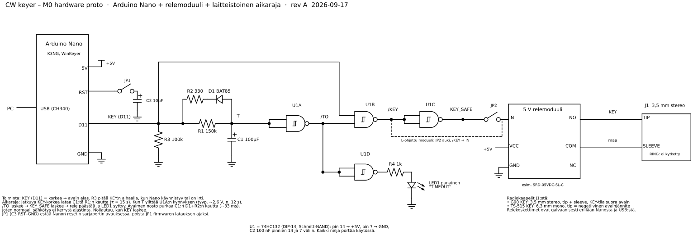

# M0 hardware proto – avainnusrajapinta

Rev A · 2026-09-17 · kytkentälevyproto, joka ohjaa radion avainlinjaa tietokoneelta WinKeyer-protokollalla.

Hyväksymiskriteeri (vaatimusmäärittely, M0 – hardware proto): *voidaan ohjata radion avainta, esim. G90:tä, tietokoneella.*

Lähteet: `cw-keyer-m0-proto.svg` / `.png` generoidaan skriptillä `schematic.py` (schemdraw). Aikarajan mitoitus: `timer_sim.py`. Komentorivitesti: `wk_test.py`.

## 1. Toimintaperiaate

| Lohko | Mitä tekee |
| --- | --- |
| Arduino Nano + K3NG | WinKeyer-emulointi USB-sarjaportissa (1200 bd). CW-ajoitus tehdään Nanossa. Avainlähtö `tx_key_line_1` = **D11**, aktiivinen korkea (K3NG:n oletus). |
| R3 100k alasveto | Pitää KEY-linjan alhaalla, kun Nano käynnistyy, bootloader on käynnissä tai johto on irti (SR-05). |
| Aikaraja R1/C1/D1/R2 | Jatkuva key-down lataa C1:tä (τ = 150 k × 100 µF = 15 s). Key-up purkaa C1:n D1:n ja R2:n kautta noin 33 ms:ssa, joten tavallinen sähkötys ei kerrytä ajastinta. |
| U1 74HC132 | U1A vertaa C1:n jännitettä Schmitt-kynnykseen → `/TO`. U1B: `/KEY = NAND(KEY, /TO)`. U1C kääntää → `KEY_SAFE`. U1D sytyttää TIMEOUT-LEDin. |
| Relemoduuli | Kytkee avainlinjan. Koskettimet ovat galvaanisesti erillään Nanosta ja PC:stä (SR-06). JP2 valitsee ohjauksen napaisuuden moduulin tyypin mukaan. |
| J1 | 3,5 mm stereojakki: TIP = avain, SLEEVE = maa, RING ei kytketty. Radiokohtaiset kaapelit tästä. |

Aikaraja on **laitteistoinen varmistus** ohjelmiston aikarajojen (SR-02, SR-03) takana: se nostaa avaimen, vaikka Nano tai PC jumittuisi avain alhaalla. Se nollautuu, kun KEY laskee.

### Aikarajan mitoitus (timer_sim.py)

74HC132:n positiivinen kynnys vaihtelee valmistajan ja yksilön mukaan, joten aika vaihtelee:

| U1A:n VT+ | Jumittuneen avaimen aikaraja |
| --- | --- |
| 1,8 V (pienin) | 7,2 s |
| 2,6 V (tyypillinen) | 11,9 s |
| 3,5 V (suurin) | 19,6 s |

Kynnysarvot: Nexperia 74HC132 -datalehti, interpoloitu 5 V:iin.

Simuloitu myös: 120 s yhtenäistä 12 WPM:n sähkötystä, 1 s viivoja 0,3 s tauoin ja kaksi 10 s TUNE-jaksoa 2 s tauolla. Mikään näistä ei laukaise aikarajaa pahimmallakaan kynnyksellä.

**Viritys:** mittaa aika sekuntikellolla (testi T3) ja säädä R1:tä: aika on suoraan verrannollinen R1:een. Tavoite 11–13 s, eli hieman ohjelmiston 10 s TUNE-rajaa pidempi, jotta ohjelmisto ehtii ensin. Esimerkki: mitattu 9 s → R1 = 150 k × 12 / 9 ≈ 200 k.

## 2. Osaluettelo

| Ref | Osa | Huomiot | Tila |
| --- | --- | --- | --- |
| – | Arduino Nano (CH340) | | ✔ on |
| – | 5 V relemoduuli, 1 kanava, FL817C-opto | Käy sellaisenaan. Tarkista ohjaus (H/L-jumpperi tai testi: IN → GND vai IN → 5V vetää releen). JD-VCC–VCC-jumpperi paikalleen. | ✔ on |
| U1 | 74HC132, DIP-14 | Nimenomaan **HC**, ei HCT: HCT:n kynnys on matalampi ja aikaraja lyhenisi noin 6 s:iin. | tilattava |
| R1 | 150 kΩ 1/4 W | Aikarajan säätövastus | tilattava |
| R2 | 330 Ω 1/4 W | Purkuvirran rajoitus (D11:n huippuvirta noin 14 mA) | tilattava |
| R3 | 100 kΩ 1/4 W | KEY-alasveto | tilattava |
| R4 | 1 kΩ 1/4 W | LEDin etuvastus | tilattava |
| C1 | 100 µF 16–25 V elektrolyytti | Hyvä merkki, pieni vuotovirta (105 °C). | tilattava |
| C2 | 100 nF keraaminen | U1:n käyttöjännitteen suodatus | tilattava |
| C3 | 10 µF 16 V elektrolyytti | Nanon automaattisen resetin esto, + RST:hen | tilattava |
| D1 | BAT85 (Schottky) | 1N4148 käy myös, jolloin aikaraja lyhenee noin 1 s. | tilattava |
| LED1 | Punainen LED 3/5 mm | TIMEOUT | tilattava |
| JP1, JP2 | Piikkirima + jumpperi | Protossa riittää dupont-johto. | tilattava |
| J1 | 3,5 mm stereojakki, kytkentälevyadapteri | | tilattava |
| – | Kaapeli 3,5 mm stereo – 3,5 mm stereo | G90 | tilattava |
| – | Adapteri/kaapeli 3,5 mm → 6,3 mm mono | TS-515 | tilattava |
| – | Kytkentälevy, hyppylangat, 2 × napsautettava ferriitti | Ferriitit USB- ja avainjohtoon | |

## 3. Kokoaminen

1. **U1:n käyttöjännite ensin:** pinni 14 → +5 V, pinni 7 → GND, C2 aivan pinnien viereen. Kaikki neljä porttia ovat käytössä, joten kelluvia tuloja ei jää.
2. 74HC132:n pinnit (DIP-14): A = 1,2 → 3 · B = 4,5 → 6 · C = 9,10 → 8 · D = 12,13 → 11.
   - U1A: pinnit 1 ja 2 → T (C1+), lähtö 3 = `/TO`
   - U1B: pinni 4 ← KEY (D11), pinni 5 ← `/TO`, lähtö 6 = `/KEY`
   - U1C: pinnit 9 ja 10 ← `/KEY`, lähtö 8 = `KEY_SAFE`
   - U1D: pinnit 12 ja 13 ← `/TO`, lähtö 11 → R4 → LED1 → GND
3. Nano: D11 → KEY-solmu (R3 maahan, R1 ja R2+D1 C1:lle). D1:n katodi (renkaan puoli) R2:n puolelle, anodi C1+:aan.
4. Relemoduuli: VCC → Nanon 5V, GND → GND. Katso moduulin piirilevystä ohjauksen tyyppi:
   - **H-ohjattu** (IN korkea = rele vetää): IN ← `KEY_SAFE` (U1 pinni 8)
   - **L-ohjattu** (IN matala = rele vetää, usein optolla ja jumpperilla "H/L"): IN ← `/KEY` (U1 pinni 6)
   - Jos moduulissa on H/L-jumpperi, valitse H ja käytä `KEY_SAFE`:a.
5. Releen NO → J1 TIP, COM → J1 SLEEVE. NC jää kytkemättä.
6. JP1/C3 kytketään vasta firmwaren latauksen jälkeen.

## 4. Firmware (K3NG)

Lähde: [k3ng/k3ng_cw_keyer](https://github.com/k3ng/k3ng_cw_keyer). Arduino IDE, kortti *Arduino Nano*, prosessori *ATmega328P (Old Bootloader)*, jos lataus ei muuten onnistu.

- `keyer_features_and_options.h`: ota käyttöön `#define FEATURE_WINKEY_EMULATION`. Pidä `FEATURE_COMMAND_LINE_INTERFACE` pois päältä, jotta sarjaportti on kokonaan WinKeyerin käytössä ja käännös pysyy pienenä. Muut ominaisuudet (BUTTONS, POTENTIOMETER, näytöt) pois.
- `keyer_pin_settings.h`: oletukset käyvät, `tx_key_line_1 11`. Paddle-pinnit 2 ja 5 ovat sisäisillä ylösvedoilla, joten kytkemättöminä ne eivät avainna. Sivuääni pinnissä 4 jää kytkemättä.
- `keyer_settings.h`: `tx_key_line_active_state HIGH` (oletus) – **älä käännä**, alasveto R3 ja aikaraja olettavat aktiivisen korkean.
- Lataus: **JP1 pois**. Laita JP1 paikalleen latauksen jälkeen. K3NG:n omassa kommentissa automaattisen resetin estämistä suositellaan WinKeyer-emuloinnissa.

## 5. Testit

Testit tehdään järjestyksessä. Radio kytketään vasta, kun T1–T4 on hyväksytty.

| # | Testi | Toimenpide | Hyväksytty kun |
| --- | --- | --- | --- |
| T1 | Käynnistys | USB kiinni ja irti 5 kertaa, Nanon reset-nappi, firmware-lataus | Rele ei vedä kertaakaan (SR-05). Yleismittari J1:ssä: auki. |
| T2 | Avain alas/ylös | `python wk_test.py COMx key 3` | Rele vetää 3 s ja päästää. J1 kiinni/auki. |
| T3 | Laitteistoinen aikaraja | `python wk_test.py COMx key 30`, sekuntikello | Rele päästää ja LED1 syttyy 11–13 s:n kohdalla (säädä R1). Ctrl+C sammuttaa LEDin. |
| T4 | Vikatilanteet | a) key 30 ja USB irti 3 s:n kohdalla. b) key 30 ja komentoikkunan sulkeminen rististä (ei Ctrl+C). | a) Rele päästää heti. b) Kirjaa, nostaako K3NG avaimen itse; jos ei, aikaraja nostaa sen T3:n ajassa (SR-04). |
| T5 | Sähkötys | `python wk_test.py COMx send "TEST TEST"`, 20 WPM | Kaiku näkyy, rele naksuttaa oikeaa rytmiä. |
| T6 | G90 tekokuormaan | G90 CW-tilaan, avaintyyppi suora avain, teho 5 W, J1 → KEY | "TEST" kuuluu sivuäänenä ja tehomittarissa. **M0-hyväksymiskriteeri.** |
| T7 | TS-515:n avainjännite | Ennen kytkentää: yleismittari DC KEY-jakin tip–runko, avain auki. Sitten mA-alue samaan (= avain alas). | Jännite ja virta kirjattu vaatimusmäärittelyyn (SR-06). Odotus noin −60…−120 V, muutama mA. |
| T8 | TS-515 tekokuormaan | Vasta T7:n jälkeen. Pieni teho, "TEST", sitten 10 s TUNE (`key 10`) | Avainnus toimii, aikaraja ei laukea 10 s:ssa. |

## 6. Turvavaatimusten kattavuus

| Vaatimus | Protossa |
| --- | --- |
| SR-02 kantoaallon aikaraja | Laitteistoinen varmistus noin 12 s. Ohjelmiston 10 s raja tulee M1:ssä. |
| SR-04 yhteyskatkos tai kaatuminen | USB irti → rele päästää heti. Nanon jumi avain alhaalla → aikaraja. Keyerin oma STOP-painike ei ole vielä mukana. |
| SR-05 käynnistys ja sulkeminen | R3 + K3NG:n oletustila. Testataan T1:ssä. |
| SR-06 jännitekesto ja erotus | Rele erottaa galvaanisesti. Tyypillisen moduulireleen koskettimet on mitoitettu 250 V AC / 30 V DC ampeeriluokan virroille; muutaman mA:n ja noin 100 V:n avainlinja on kevyt kuorma, mutta mitoitus tarkistetaan T7:n mittauksen jälkeen. |

## 7. Tunnetut rajoitukset ja rev B

- **Releen viive:** vetoaika noin 10 ms ja päästöaika noin 5 ms lyhentävät pisteitä. Tämä sopii noin 25 WPM:ään asti; tarvittaessa K3NG:n/WinKeyerin *key compensation* korjaa.
- **Kuiva kontakti G90:ssä:** G90:n avainlinjassa on vain muutama voltti ja pieni virta, jolloin tavallisen releen hopeakoskettimet voivat hapettua ja avainnus katkeilla. Jos näin käy, vaihda reed-releeseen.
- **Mekaaninen kuluminen:** rele ei sovi pitkään käyttöön eikä Hell-avainnukseen (D7).
- **Rev B:** releen tilalle PhotoMOS-rele (esim. PVT412, 400 V, napaisuudeton), joka toimii sellaisenaan sekä G90:n positiivisella että TS-515:n negatiivisella avainjännitteellä. H11D1 käy myös, mutta negatiivisella avainjännitteellä kollektori kytketään runkoon ja emitteri avainlinjaan, ja G90:lle napaisuus on päinvastainen.
- **Myöhemmin:** keyerin oma STOP-painike (SR-04), RF-suodatus J1:lle (1–10 nF / 500 V vain, jos RF-ongelmia ilmenee), paddle-tulo.
